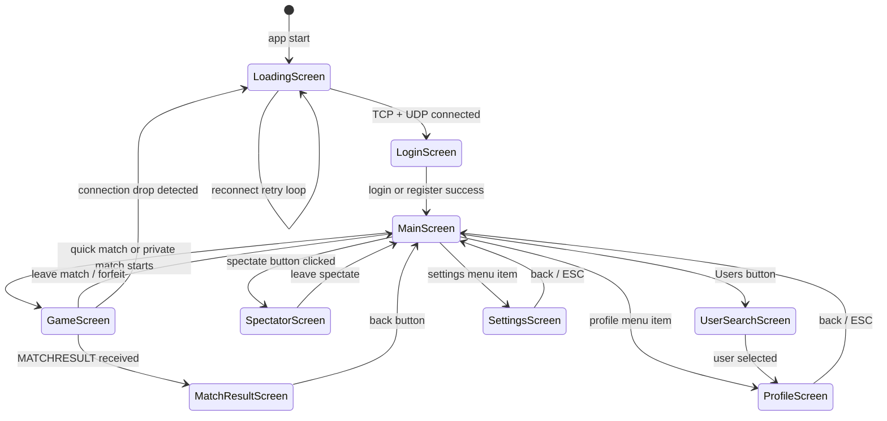
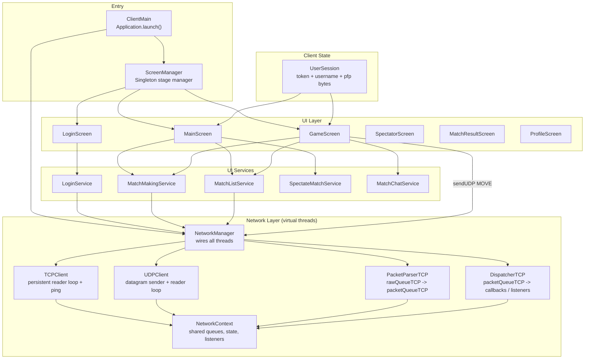
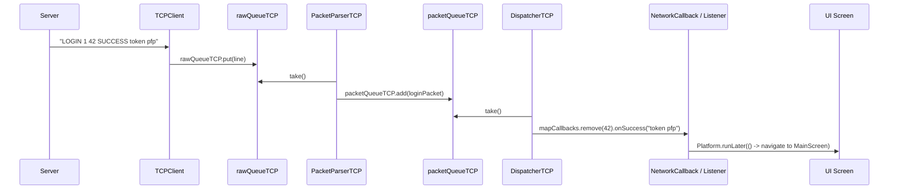
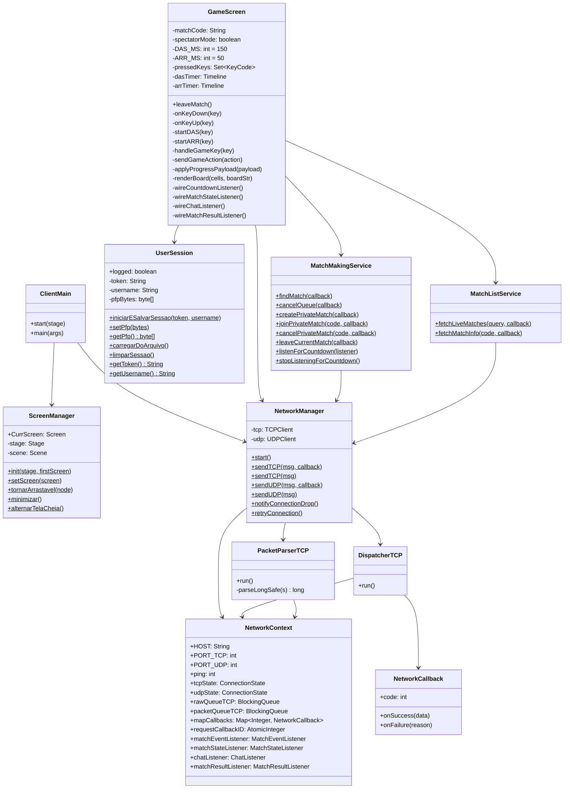
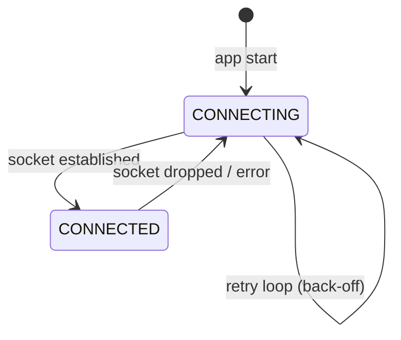

# Jetris — Client

The Jetris client is a JavaFX 21 desktop application. It connects to the Jetris server over TCP (control) and UDP (game input), renders the Tetris boards in real time, and manages user authentication, matchmaking, spectating, chat, and profiles through animated screens.

---

## How to Run

### Prerequisites

- Java 21+
- Maven 3.8+

### Configuration

Create `src/main/resources/config/.env` (resolved from the working directory at runtime under `/config`):

```env
SERVER_HOST=127.0.0.1
SERVER_PORT_TCP=9090
SERVER_PORT_UDP=9091
```

### Run

```bash
mvn exec:java
# or with the JavaFX Maven plugin:
mvn javafx:run
```

### Build Native Package (Windows)

```bash
mvn package
# Produces target/dist/JetrisOnline/
```

---

## Screen Flow



---

## Architecture Overview



---

## Network Pipeline Detail



The three consumer threads (TCPClient reader, PacketParserTCP, DispatcherTCP) each run in their own virtual thread, connected by `LinkedBlockingQueue` instances. This keeps the JavaFX thread free at all times — all UI updates go through `Platform.runLater()`.

Push packets (those the server sends without a prior client request, such as `MATCH_COUNTDOWN`, `MATCH_STATE`, `MATCH_ABORT`, `MATCHRESULT`, and `CHAT`) are routed by `DispatcherTCP` to volatile listener interfaces stored in `NetworkContext`. The active screen registers itself as a listener on construction and clears the listener on departure.

---

## Key Client Classes



---

## DAS / ARR — Input System

Tetris players hold keys to move pieces. Without DAS/ARR, holding a key would fire one move per OS key-repeat interval, which is too slow and inconsistent for competitive play. Jetris implements its own timing entirely in JavaFX:

| Term | Value | Meaning |
|---|---|---|
| DAS (Delayed Auto Shift) | 150 ms | Time from first key press until auto-repeat begins |
| ARR (Auto Repeat Rate) | 50 ms | Interval between repeated moves during auto-repeat |

**Flow:**

```
KeyDown(LEFT / RIGHT / DOWN)
  -> handleGameKey(key)   (immediate first move)
  -> startDAS(key)
       -> after 150 ms: startARR(key)
            -> every 50 ms: handleGameKey(key) while key is held
KeyUp(key)
  -> stopDAS()   (cancels dasTimer and arrTimer)
```

DOWN bypasses DAS and goes directly to ARR (no initial delay for soft drop). ROTATE and DROP (hard drop via SPACE) are single-fire with no repeat.

Each key action calls `sendGameAction(action)` which sends:

```
MOVE 0 0 <token> <matchCode> <action>
```

over UDP.

---

## Listener Model for Push Packets

`NetworkContext` exposes four volatile listener slots:

| Listener Interface | Used By | Triggered By |
|---|---|---|
| `MatchEventListener` | `GameScreen`, `MainScreen` | `MATCH_COUNTDOWN`, `MATCH_ABORT` |
| `MatchStateListener` | `GameScreen`, `SpectatorScreen` | `MATCH_STATE` |
| `ChatListener` | `GameScreen`, `SpectatorScreen` | `CHAT` |
| `MatchResultListener` | `GameScreen` | `MATCHRESULT` |

Screens register their listener on construction and set it to `null` (or replace it) when navigating away. Because each listener is a single volatile reference, only one screen can listen at a time — which is the correct behavior since only one screen is active.

---

## Screens Reference

| Screen | Description |
|---|---|
| `LoadingScreen` | Shown while TCP/UDP connect or reconnect. Auto-advances to `LoginScreen`. |
| `LoginScreen` | Username/password login and new account registration. Animated slide between forms. |
| `MainScreen` | Match lobby: quick match, private match creation/join, live match list with spectate, ping display. |
| `GameScreen` | 10x20 board for the local player + smaller opponent board, chat panel, countdown overlay, DAS/ARR input. Also used as a base for `SpectatorScreen`. |
| `SpectatorScreen` | Extends `GameScreen` in spectator mode — shows both full-size boards side by side, no input. |
| `MatchResultScreen` | Win/loss badge, match code, start/end times, duration, back button. |
| `ProfileScreen` | Avatar, username, win/loss stats, paginated match history. |
| `UserSearchScreen` | Prefix-based user search, click to open profile. |
| `SettingsScreen` | App settings (avatar upload, account deletion). |

---

## Connection State Machine



`NetworkManager.downHandlerLoop()` checks TCP and UDP state every second. If either is not `CONNECTED`, it calls `UpdatePing(-1)` on the current screen and, if not already on `LoadingScreen`, calls `notifyConnectionDrop()` to navigate back there so the reconnect loop can re-establish both connections.
