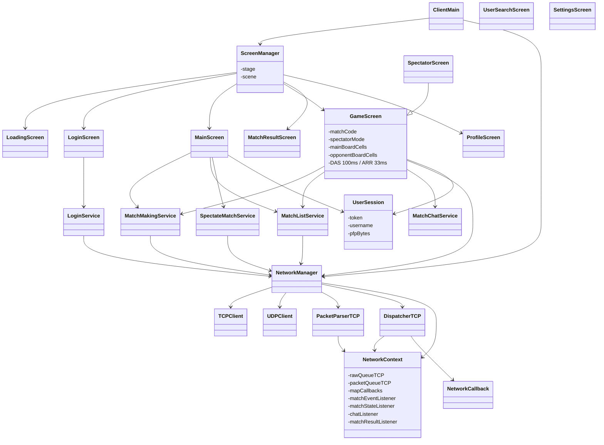

# Jetris — Client

JavaFX 21 desktop application. Connects to the server over TCP (control/state) and UDP (game input). All game logic runs on the server — the client renders board state as it arrives and sends key actions over UDP.

Three virtual threads run in the background: a TCP reader, a packet parser, and a dispatcher. The dispatcher routes parsed packets to either a `NetworkCallback` (for request/response flows) or a push listener on `NetworkContext` (for server-initiated packets like board updates and chat).

---

## How to Run

Create `src/main/resources/config/.env`:

```env
SERVER_HOST=127.0.0.1
SERVER_PORT_TCP=9090
SERVER_PORT_UDP=9091
```

```bash
mvn exec:java
# or build a native package (Windows):
mvn package
```

---

## Class Diagram


