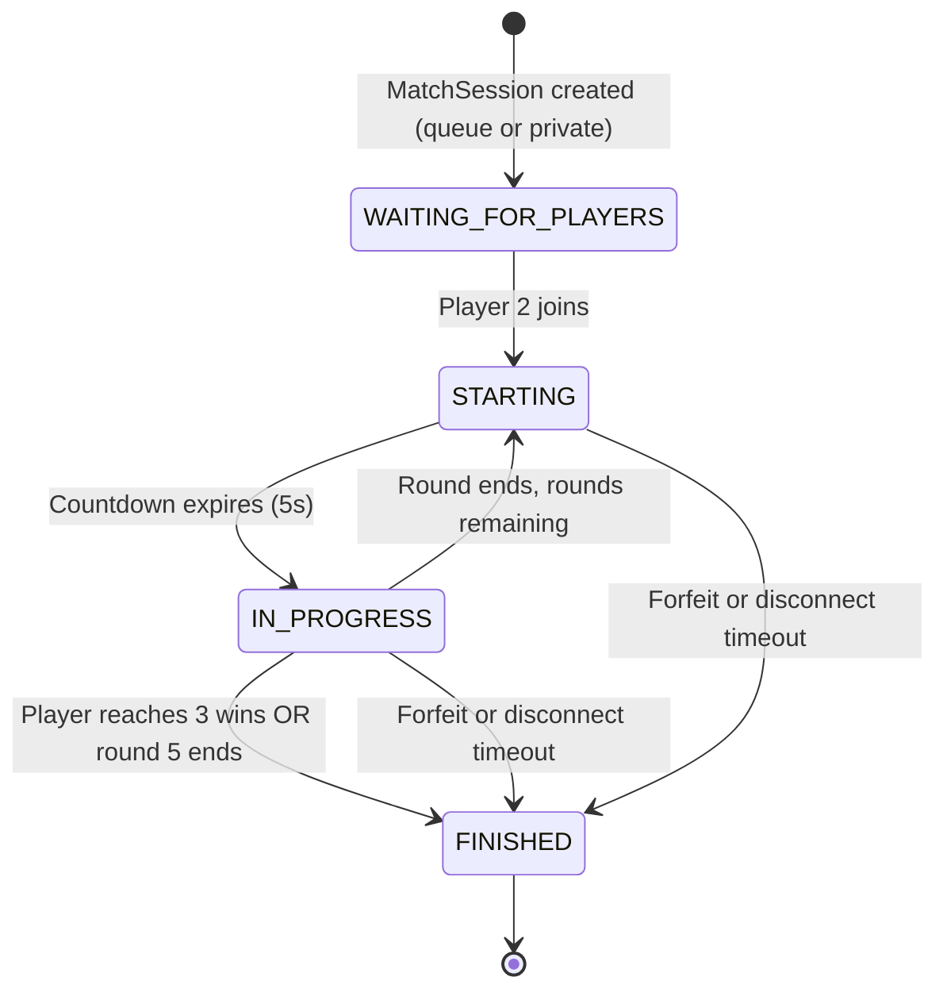

# Jetris Network Protocol Reference

Jetris uses two transport channels simultaneously:

- **TCP** — persistent text-based connection for authentication, matchmaking control, profile operations, and server-pushed events.
- **UDP** — stateless datagrams for high-frequency real-time game input (player moves).

Both channels share the same packet format (see [HTTP_PROTOCOL.md](HTTP_PROTOCOL.md) for the design rationale).

---

## Packet Format

```
TYPE code callbackCode body
```

| Field | Type | Description |
|---|---|---|
| `TYPE` | String (uppercase) | Message category: `LOGIN`, `MATCH`, `MOVE`, etc. |
| `code` | Integer | Sub-operation within the type |
| `callbackCode` | Integer | Correlation ID: client sets this on requests; server echoes it back so the client can match responses to callbacks. Server-pushed messages use `0`. |
| `body` | String (rest of line) | Payload — format is specific to each TYPE/code combination |

All fields are space-delimited. The body occupies the entire remainder of the line, so it can itself contain spaces. The packet is terminated by a newline (`\n`) on TCP.

**Example:**

```
LOGIN 1 42 myUser myPassword
```

Response:

```
LOGIN 1 42 SUCCESS abc123-token-uuid base64encodedPfp
```

---

## TCP — Client to Server Requests

### AUTH

| TYPE | code | Body format | Description |
|---|---|---|---|
| `LOGIN` | `0` | `token` | Re-authenticate with a cached token (no password needed) |
| `LOGIN` | `1` | `username password` | Full login with credentials |
| `REGISTER` | `0` | `username password` | Create new account |
| `LOGOUT` | `0` | `token` | Log out (destroys session, immediate forfeit if in match) |
| `DELETE_ACCOUNT` | `0` | `token` | Delete account permanently |

**Username rules:** 5-25 chars, `[a-zA-Z0-9_]` only  
**Password rules:** 6-30 chars, no spaces

### PROFILE

| TYPE | code | Body format | Description |
|---|---|---|---|
| `GETPROFILE` | `0` | `token username` | Search users by prefix (returns up to 10 matches) |
| `GETPROFILE` | `1` | `token username page` | Get full profile + paginated match history (10 per page) |
| `SETPFP` | `0` | `token username base64PngImage` | Upload new avatar (PNG only, max 5 MB) |

### MATCH (Matchmaking and Control)

| TYPE | code | Body format | Description |
|---|---|---|---|
| `MATCH` | `0` | `token` | Join the public matchmaking queue |
| `MATCH` | `1` | `token` | Leave the queue |
| `MATCH` | `2` | `token` | Create a private match room |
| `MATCH` | `3` | `token matchCode` | Join a private match by 6-char code |
| `MATCH` | `4` | `token matchCode` | Cancel a private match you created |
| `MATCH` | `5` | `token query` | Fetch live match list (optional search query) |
| `MATCH` | `6` | `token` | Forfeit and leave the current active match |
| `MATCH` | `7` | `token matchCode` | Fetch info for a specific match |
| `MATCH` | `8` | `token matchCode` | Fetch result for a finished match |

### SPECTATE

| TYPE | code | Body format | Description |
|---|---|---|---|
| `SPECTATE` | `0` | `token matchCode` | Join a match as spectator |

### CHAT

| TYPE | code | Body format | Description |
|---|---|---|---|
| `CHAT` | `0` | `token matchCode message` | Send a chat message (max 100 chars after sanitization) |

### Keepalive

| Message | Description |
|---|---|
| `PING` | Sent by either side. Server replies with `PONG`. No TYPE/code/callbackCode format — just the literal string. |

---

## TCP — Server to Client Responses

### AUTH Responses

| TYPE | code | callbackCode | Body | Condition |
|---|---|---|---|---|
| `LOGIN` | `0` or `1` | echoed | `SUCCESS token base64Pfp` | Login succeeded |
| `LOGIN` | `0` or `1` | echoed | `FAIL reason` | Login failed |
| `REGISTER` | `0` | echoed | `SUCCESS` | Registration succeeded |
| `REGISTER` | `0` | echoed | `FAIL reason` | Registration failed |
| `LOGOUT` | `0` | echoed | `SUCCESS` | Logout succeeded |
| `DELETE_ACCOUNT` | `0` | echoed | `SUCCESS` | Account deleted |
| `DELETE_ACCOUNT` | `0` | echoed | `FAIL reason` | Deletion failed |

**Login failure reasons:** `IP_already_in_use`, `User_already_online`, `Token_expired_or_invalid`, `Invalid_credentials`, `Invalid_username_format`, `Invalid_password_format`, `Database_error`

**Register failure reasons:** `Invalid_fields`, `Invalid_username_format`, `Invalid_password_format`, `Username_already_taken`, `Database_error`

### PROFILE Responses

| TYPE | code | Body | Description |
|---|---|---|---|
| `GETPROFILE` | `0` | `count username1 pfp1 username2 pfp2 ...` | User search results |
| `GETPROFILE` | `0` | `EMPTY` | No results |
| `GETPROFILE` | `1` | `username pfpBase64 wins losses totalMatches totalPages page matchCount [match1fields...]` | Full profile |
| `GETPROFILE` | `1` | `EMPTY` | User not found |
| `SETPFP` | `0` | `SUCCESS` | Avatar updated |
| `SETPFP` | `0` | `USER_NOT_FOUND` / `FILE_TOO_LARGE` / `INVALID_FORMAT` / `DB_ERROR` | Avatar update failed |

**Match history entry fields (space-separated):** `player1 player2 durationSeconds score1 score2 won matchDateMillis`  
`won` is `true` or `false` from the perspective of the requesting user.

### MATCH Responses

| TYPE | code | callbackCode | Body | Condition |
|---|---|---|---|---|
| `MATCH` | `0` | echoed | `SUCCESS QUEUED` | Added to queue, waiting |
| `MATCH` | `0` | `0` (push) | `SUCCESS START matchCode` | Match found while in queue (pushed to waiting player) |
| `MATCH` | `0` | echoed | `SUCCESS START matchCode` | Match found immediately on join |
| `MATCH` | `0` | echoed | `FAIL Already_in_queue` | Already queued |
| `MATCH` | `1` | echoed | `SUCCESS LEAVED` | Left queue |
| `MATCH` | `2` | echoed | `SUCCESS CREATED matchCode` | Private room created |
| `MATCH` | `3` | `0` (push) | `SUCCESS START matchCode` | Opponent joined private match (pushed to host) |
| `MATCH` | `3` | echoed | `SUCCESS START matchCode` | Joined private match |
| `MATCH` | `3` | echoed | `FAIL Invalid_or_full` | Room not found or full |
| `MATCH` | `4` | echoed | `SUCCESS LEAVED` | Private room cancelled |
| `MATCH` | `4` | echoed | `FAIL Not_found` | Room not found |
| `MATCH` | `5` | echoed | `SUCCESS count entry1\|\|entry2\|\|...` | Live match list |
| `MATCH` | `6` | echoed | `SUCCESS LEAVED` | Left/forfeited match |
| `MATCH` | `6` | echoed | `FAIL Not_in_active_match` | Not in a match |
| `MATCH` | `7` | echoed | `SUCCESS matchInfoPayload` | Single match info |
| `MATCHRESULT` | `0` | `0` (push) | `SUCCESS matchCode\|outcome\|reason\|startMs\|endMs` | Match finished result |
| `MATCHRESULT` | `0` | echoed | `SUCCESS matchCode\|outcome\|reason\|startMs\|endMs` | Polled result |

**outcome:** `WIN` or `LOSE` (perspective of the requesting user)

### Match List Entry Format (MATCH 5 and MATCH 7)

Each entry in MATCH 5 is pipe-separated; multiple entries are double-pipe-separated (`||`):

```
matchCode|player1Name|player1PfpBase64|player2Name|player2PfpBase64|state|spectatorCount|player1Id|player2Id|startTimeMillis
```

MATCH 7 returns a single entry in the same format (no count prefix, no `||` separator).

### Server Push Packets (callbackCode = 0)

These are sent by the server without a prior client request. The client must have an active listener registered in `NetworkContext`.

#### MATCH_COUNTDOWN

Sent every game-loop tick during the pre-round countdown (5 seconds):

```
MATCH_COUNTDOWN 0 0 matchCode secondsLeft
```

`secondsLeft` counts down from 5 to 0. When `secondsLeft` reaches 0, the client transitions to the in-game view.

#### MATCH_STATE

The primary real-time state broadcast. Sent on every game event (gravity step, player input, round transitions):

```
MATCH_STATE 0 0 matchCode state payload
```

| `state` | `payload` format | When |
|---|---|---|
| `ROUND_START` | `round\|secondsLeft` | Start of countdown for a new round |
| `IN_PROGRESS` | see below | Every gravity tick or player input |
| `ROUND_END` | `round\|winnerUserId\|reason\|wins1\|wins2` | When a round concludes |

**IN_PROGRESS payload:**

```
round|wins1|wins2|score1|score2|board1|board2|nextPiece1|nextPiece2|garbage1|garbage2
```

| Field | Description |
|---|---|
| `round` | Current round number |
| `wins1` / `wins2` | Round wins for player 1 / player 2 |
| `score1` / `score2` | Scores (lines cleared * 100) |
| `board1` / `board2` | 200-character board string (10 cols x 20 rows, row-major). `'.'` = empty, `'1'-'7'` = piece type, `'8'` = garbage |
| `nextPiece1` / `nextPiece2` | Next piece index as `'1'-'7'` |
| `garbage1` / `garbage2` | Pending garbage lines for each player |

**ROUND_END reasons:** `Topout` (board overflow), `Player_left` (forfeit), `Player_timeout` (disconnect grace expired)

#### MATCH_ABORT

Sent when a match is cancelled before or during play (e.g. host leaves private lobby, or forfeit):

```
MATCH_ABORT 0 0 matchCode reason
```

**Reasons:** `Player_left`, `Player_timeout`

#### MATCHRESULT

Sent when the match concludes with a final winner (after all rounds):

```
MATCHRESULT 0 0 SUCCESS matchCode|outcome|reason|startTimeMillis|endTimeMillis
```

#### CHAT

Broadcast to all participants (players + spectators) of the match:

```
CHAT 0 0 matchCode senderId senderName message
```

---

## UDP — Client to Server

All UDP packets use the same format. Only `MOVE` is currently defined:

```
MOVE 0 0 token matchCode action
```

| `action` | Description |
|---|---|
| `LEFT` | Move piece left |
| `RIGHT` | Move piece right |
| `DOWN` | Soft drop (one row) |
| `ROTATE` | Rotate piece clockwise (with wall kicks) |
| `DROP` | Hard drop (instant lock) |

The server validates the token and match code on every packet. The UDP middleware chain applies a 50 ms rate limit per IP.

---

## Match State Machine



---

## Example Packet Flows

### Login Flow

```
Client -> Server:  LOGIN 1 1 gabriel mypassword
Server -> Client:  LOGIN 1 1 SUCCESS 550e8400-e29b-41d4-a716-446655440000 iVBORw0KGgo...
```

### Registration Flow

```
Client -> Server:  REGISTER 0 2 newuser password123
Server -> Client:  REGISTER 0 2 SUCCESS
```

Failed case:

```
Client -> Server:  REGISTER 0 3 ab pass
Server -> Client:  REGISTER 0 3 FAIL Invalid_username_format
```

### Matchmaking — Quick Match (both players queue)

```
Player1 -> Server:  MATCH 0 10 token1
Server -> Player1:  MATCH 0 10 SUCCESS QUEUED

Player2 -> Server:  MATCH 0 11 token2
Server -> Player1:  MATCH 0 0 SUCCESS START a1b2c3d4          <- push, callbackCode=0
Server -> Player2:  MATCH 0 11 SUCCESS START a1b2c3d4

# Both clients now navigate to GameScreen("a1b2c3d4")
```

### Private Match Flow

```
Host -> Server:    MATCH 2 20 hostToken
Server -> Host:    MATCH 2 20 SUCCESS CREATED ABC123

Guest -> Server:   MATCH 3 21 guestToken ABC123
Server -> Host:    MATCH 3 0 SUCCESS START ABC123              <- push to host
Server -> Guest:   MATCH 3 21 SUCCESS START ABC123
```

### Round Start Countdown (5 seconds)

```
Server -> All:  MATCH_STATE 0 0 a1b2c3d4 ROUND_START 1|5
Server -> All:  MATCH_COUNTDOWN 0 0 a1b2c3d4 5
Server -> All:  MATCH_COUNTDOWN 0 0 a1b2c3d4 4
Server -> All:  MATCH_COUNTDOWN 0 0 a1b2c3d4 3
Server -> All:  MATCH_COUNTDOWN 0 0 a1b2c3d4 2
Server -> All:  MATCH_COUNTDOWN 0 0 a1b2c3d4 1
Server -> All:  MATCH_COUNTDOWN 0 0 a1b2c3d4 0
# Transitions to IN_PROGRESS
Server -> All:  MATCH_STATE 0 0 a1b2c3d4 IN_PROGRESS 1|0|0|0|0|..........|..........|2|3|0|0
```

### In-Progress Game Input

```
Player1 -> Server (UDP):  MOVE 0 0 token1 a1b2c3d4 LEFT
Server -> All (TCP):      MATCH_STATE 0 0 a1b2c3d4 IN_PROGRESS 1|0|0|100|0|..1.......| ...|2|3|0|0
```

### Round End and New Round

```
# Player2 tops out
Server -> All:  MATCH_STATE 0 0 a1b2c3d4 ROUND_END 1|12345|Topout|1|0
# Player1 userId=12345 won round 1. Score: Player1 wins=1, Player2 wins=0

# New round countdown begins
Server -> All:  MATCH_STATE 0 0 a1b2c3d4 ROUND_START 2|5
Server -> All:  MATCH_COUNTDOWN 0 0 a1b2c3d4 5
# ...
```

### Match Result (Player1 wins the series 3-1)

```
Server -> Player1:  MATCHRESULT 0 0 SUCCESS a1b2c3d4|WIN|Topout|1719000000000|1719003600000
Server -> Player2:  MATCHRESULT 0 0 SUCCESS a1b2c3d4|LOSE|Topout|1719000000000|1719003600000
```

### Forfeit

```
Player2 -> Server:  MATCH 6 30 token2
Server -> Player1:  MATCH_ABORT 0 0 a1b2c3d4 Player_left
Server -> Player2:  MATCH 6 30 SUCCESS LEAVED
Server -> Player1:  MATCHRESULT 0 0 SUCCESS a1b2c3d4|WIN|Player_left|startMs|endMs
```

### Disconnect Grace Period

```
# Player2 disconnects (TCP socket drops)
# Server schedules 30-second forfeit timer

# If Player2 reconnects within 30s:
Player2 -> Server:  LOGIN 0 1 cachedToken
Server -> Player2:  LOGIN 0 1 SUCCESS cachedToken pfpBase64
# Timer cancelled, match continues

# If Player2 does NOT reconnect in 30s:
Server -> Player1:  MATCH_ABORT 0 0 a1b2c3d4 Player_timeout
Server -> Player1:  MATCHRESULT 0 0 SUCCESS a1b2c3d4|WIN|Player_timeout|startMs|endMs
```

### Chat

```
Player1 -> Server:  CHAT 0 0 token1 a1b2c3d4 Hello everyone!
Server -> All:      CHAT 0 0 a1b2c3d4 12345 gabriel Hello everyone!
```

### Spectate

```
Viewer -> Server:   SPECTATE 0 40 viewerToken a1b2c3d4
Server -> Viewer:   SPECTATE 0 40 SUCCESS JOINED a1b2c3d4
# Viewer now receives all MATCH_STATE and CHAT broadcasts for a1b2c3d4
```

---

## Error / Failure Reasons Reference

| Reason | Context |
|---|---|
| `IP_already_in_use` | Login: another user is already logged in from this IP |
| `User_already_online` | Login: this account is already active on another connection |
| `Token_expired_or_invalid` | Token re-auth failed |
| `Invalid_credentials` | Wrong username or password |
| `Invalid_username_format` | Username too short/long or invalid chars |
| `Invalid_password_format` | Password too short/long or contains spaces |
| `Username_already_taken` | Registration: username exists |
| `Database_error` | Internal DB error |
| `Already_in_queue` | Already waiting for a match |
| `Invalid_or_full` | Private room not found or already started |
| `Not_found` | Private room not found for cancellation |
| `Not_in_active_match` | Tried to leave a match but not in one |
| `Player_left` | Opponent forfeited or left |
| `Player_timeout` | Opponent disconnected and grace period expired |
| `Topout` | Board overflow — round ended by topping out |
| `Match_not_available` | Spectate: match is not active or user is already a player |
| `USER_NOT_FOUND` | Profile: username not found during avatar upload |
| `FILE_TOO_LARGE` | Avatar: image exceeds 5 MB |
| `INVALID_FORMAT` | Avatar: file is not a valid PNG |
