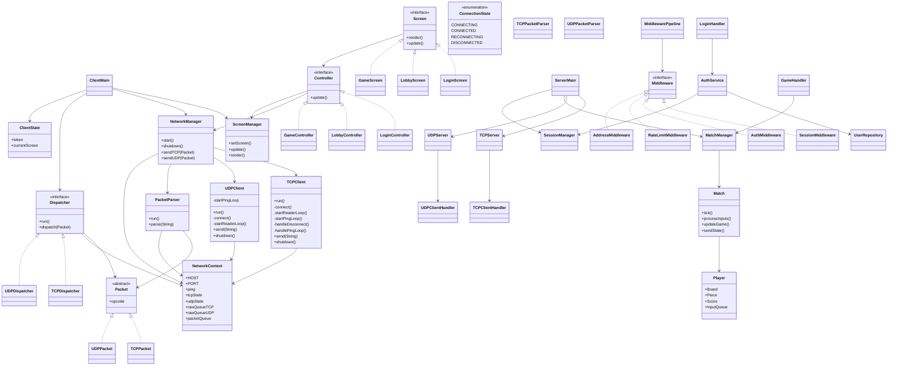

# Jetris

## UML

```mermaid
classDiagram

%% =========================
%% CLIENTE
%% =========================

class ClientMain

class ScreenManager {
  +setScreen()
  +update()
  +render()
}

class Screen {
  <<interface>>
  +render()
  +update()
}

class LoginScreen
class LobbyScreen
class GameScreen

Screen <|.. LoginScreen
Screen <|.. LobbyScreen
Screen <|.. GameScreen

class Controller {
  <<interface>>
  +update()
}

class LoginController
class LobbyController
class GameController

Controller <|.. LoginController
Controller <|.. LobbyController
Controller <|.. GameController

%% =========================
%% NETWORK
%% =========================

class NetworkManager {
  +start()
  +shutdown()

  +sendTCP(Packet)
  +sendUDP(Packet)
}

class TCPClient {
  +run()

  -connect()
  -startReaderLoop()
  -startPingLoop()
  -handleDisconnect()
  -handlePingLoop()

  +send(String)
  +shutdown()
}

class UDPClient {
  +run()

  -connect()
  -startReaderLoop()
  -startPingLoop
  
  +send(String)
  +shutdown()
}

class PacketParser {
  +run()
  +parse(String)
}

class Dispatcher {
  +run()
  +dispatch(Packet)
}

class Packet {
  <<abstract>>
  +opcode
}

class NetworkContext {
  +HOST
  +PORT

  +ping

  +tcpState
  +udpState

  +rawQueueTCP
  +rawQueueUDP
  +packetQueue
}

class ConnectionState {
  <<enumeration>>

  CONNECTING
  CONNECTED
  RECONNECTING
  DISCONNECTED
}

%% =========================
%% STATE
%% =========================

class ClientState {
  +token
  +currentScreen
}

%% =========================
%% RELAÇÕES
%% =========================

ClientMain --> ScreenManager
ClientMain --> NetworkManager
ClientMain --> Dispatcher
ClientMain --> ClientState

NetworkManager --> TCPClient
NetworkManager --> UDPClient
NetworkManager --> PacketParser

PacketParser --> Packet
Dispatcher --> Packet

Screen --> Controller
Controller --> NetworkManager
Controller --> ScreenManager

TCPClient --> NetworkContext
UDPClient --> NetworkContext
PacketParser --> NetworkContext
Dispatcher --> NetworkContext
NetworkManager --> NetworkContext


%% =========================
%% SERVIDOR
%% =========================

class ServerMain

class TCPServer
class UDPServer

class TCPClientHandler
class UDPClientHandler

TCPServer --> TCPClientHandler
UDPServer --> UDPClientHandler

class Packet {
  <<interface>>
}

class TCPPacket
class UDPPacket

Packet <|.. TCPPacket
Packet <|.. UDPPacket

class TCPPacketParser
class UDPPacketParser

class Dispatcher {
  <<interface>>
}

class TCPDispatcher
class UDPDispatcher

Dispatcher <|.. TCPDispatcher
Dispatcher <|.. UDPDispatcher

class MiddlewarePipeline
class Middleware {
  <<interface>>
}

class SessionMiddleware
class AuthMiddleware
class RateLimitMiddleware
class AddressMiddleware

Middleware <|.. SessionMiddleware
Middleware <|.. AuthMiddleware
Middleware <|.. RateLimitMiddleware
Middleware <|.. AddressMiddleware

MiddlewarePipeline --> Middleware

class AuthService
class UserRepository
class SessionManager

class LoginHandler
class GameHandler

class MatchManager
class Match {
  +tick()
  +processInputs()
  +updateGame()
  +sendState()
}

class Player {
  +Board
  +Piece
  +Score
  +InputQueue
}

ServerMain --> TCPServer
ServerMain --> UDPServer
ServerMain --> MatchManager
ServerMain --> SessionManager

MatchManager --> Match
Match --> Player

AuthService --> UserRepository
AuthService --> SessionManager

LoginHandler --> AuthService
GameHandler --> MatchManager
```
