# Jetris

```text
CLIENTE
│
├── Interface gráfica
├── Renderização do Tetris
├── Input do jogador
├── Áudio
├── Chat UI
├── Spectate UI
├── Perfil e configurações
│
├── TCP
│   ├── Login
│   ├── Registro
│   ├── Chat
│   ├── Amigos
│   ├── Ranking
│   ├── Convites
│   └── Matchmaking
│
└── UDP
    ├── Movimentos
    ├── Atualização do tabuleiro
    ├── Garbage lines
    └── Sincronização da partida


SERVIDOR
│
├── Autenticação
├── Middleware
├── Sessões
├── Matchmaking
├── Persistência
├── Chat
├── Ranking
├── Spectate
├── Partidas ativas
│
├── TCP SERVER
│   └── Requisições confiáveis
│
└── UDP SERVER
    └── Atualizações rápidas do jogo
```

---

# Estrutura REAL do Projeto

```text
src/
│
├── client/
│   │
│   ├── main/
│   │   └── ClientMain.java
│   │
│   ├── network/
│   │   ├── tcp/
│   │   │   ├── TcpClient.java
│   │   │   ├── TcpPacketSender.java
│   │   │   └── TcpPacketReceiver.java
│   │   │
│   │   └── udp/
│   │       ├── UdpClient.java
│   │       ├── UdpGameSender.java
│   │       └── UdpGameReceiver.java
│   │
│   ├── view/
│   │   ├── screens/
│   │   ├── components/
│   │   └── animations/
│   │
│   ├── controller/
│   │   ├── ScreenManager.java
│   │   ├── InputController.java
│   │   └── AudioController.java
│   │
│   ├── game/
│   │   ├── TetrisRenderer.java
│   │   ├── LocalGameState.java
│   │   └── EffectManager.java
│   │
│   └── util/
│
│
├── server/
│   │
│   ├── main/
│   │   └── ServerMain.java
│   │
│   ├── network/
│   │   │
│   │   ├── tcp/
│   │   │   ├── TcpServer.java
│   │   │   ├── TcpClientHandler.java
│   │   │   └── TcpPacketRouter.java
│   │   │
│   │   └── udp/
│   │       ├── UdpServer.java
│   │       ├── UdpPacketHandler.java
│   │       ├── UdpMatchSession.java
│   │       └── UdpStateBroadcaster.java
│   │
│   ├── middleware/
│   │   ├── Middleware.java
│   │   ├── MiddlewarePipeline.java
│   │   ├── AuthMiddleware.java
│   │   ├── RateLimitMiddleware.java
│   │   ├── PacketValidationMiddleware.java
│   │   └── LoggingMiddleware.java
│   │
│   ├── session/
│   │   ├── SessionManager.java
│   │   ├── AuthToken.java
│   │   └── OnlineUserRegistry.java
│   │
│   ├── matchmaking/
│   │   ├── MatchManager.java
│   │   ├── MatchQueue.java
│   │   └── Matchmaker.java
│   │
│   ├── service/
│   │   ├── AuthService.java
│   │   ├── UserService.java
│   │   ├── RankingService.java
│   │   ├── SocialService.java
│   │   └── MatchService.java
│   │
│   ├── persistence/
│   │   ├── repository/
│   │   ├── database/
│   │   ├── file/
│   │   └── serializer/
│   │
│   └── util/
│
│
├── shared/
│   │
│   ├── model/
│   │   ├── user/
│   │   ├── match/
│   │   ├── game/
│   │   └── social/
│   │
│   ├── packet/
│   │   ├── auth/
│   │   ├── chat/
│   │   ├── matchmaking/
│   │   ├── game/
│   │   └── spectate/
│   │
│   ├── protocol/
│   │   ├── Opcode.java
│   │   ├── PacketDirection.java
│   │   └── ProtocolVersion.java
│   │
│   ├── exception/
│   │
│   ├── enums/
│   │
│   ├── interfaces/
│   │
│   └── util/
│
│
└── assets/
    ├── audio/
    ├── fonts/
    ├── textures/
    ├── pfps/
    └── themes/
```

---

# UML

```mermaid
classDiagram
direction TB

%% =========================================================
%% ======================== CLIENT =========================
%% =========================================================

class ClientMain {
    +main(String[] args) void
}

class TcpClient {
    -Socket socket
    -ObjectInputStream in
    -ObjectOutputStream out

    +connect() void
    +send(Packet packet) void
    +disconnect() void
}

class UdpClient {
    -DatagramSocket socket
    -InetAddress serverAddress
    -int serverPort

    +send(Packet packet) void
    +listen() void
}

class ScreenManager {
    -Screen currentScreen

    +changeScreen(Screen s) void
    +getCurrentScreen() Screen
}

class Screen {
    <<abstract>>

    -String title

    +render(Graphics g) void
    +update() void
    +handleKeyboard(KeyEvent e) void
    +handleMouse(MouseEvent e) void
}

class LoginScreen {
    -String username
    -String password

    +attemptLogin() void
}

class RegisterScreen {
    +createAccount() void
}

class HomeScreen {
    -List~Match~ liveMatches
    -List~User~ onlineFriends

    +searchMatch(String query) void
    +inviteFriend(String friendId) void
    +spectateMatch(String hash) void
}

class ProfileScreen {
    -User viewedUser

    +editBio() void
    +changePfp() void
}

class MatchScreen {
    -GameState localState
    -boolean spectating

    +sendMove() void
    +renderBoard() void
}

class SpectateScreen {
    -Match match

    +watchMatch() void
}

class ChatScreen {
    -Map~User, List~ChatMessage~~ chats

    +sendMessage() void
}

class RankingScreen {
    -List~User~ rankings

    +showGlobalRanking() void
    +showFriendsRanking() void
}

class SettingsScreen {
    -UserSettings settings

    +changeTheme() void
    +changeVolume() void
}

Screen <|-- LoginScreen
Screen <|-- RegisterScreen
Screen <|-- HomeScreen
Screen <|-- ProfileScreen
Screen <|-- MatchScreen
Screen <|-- SpectateScreen
Screen <|-- ChatScreen
Screen <|-- RankingScreen
Screen <|-- SettingsScreen

ScreenManager --> Screen

ClientMain --> TcpClient
ClientMain --> UdpClient
ClientMain --> ScreenManager

%% =========================================================
%% ======================== SERVER =========================
%% =========================================================

class ServerMain {
    +main(String[] args) void
}

class TcpServer {
    -ServerSocket serverSocket
    -ExecutorService threadPool

    +start() void
    +acceptClients() void
}

class TcpClientHandler {
    -Socket socket
    -User authenticatedUser

    +run() void
    +send(Packet packet) void
}

class UdpServer {
    -DatagramSocket socket

    +listen() void
    +send(Packet packet) void
}

class UdpMatchSession {
    -Match match

    +syncGameState() void
    +broadcastMoves() void
}

class Middleware {
    <<interface>>

    +handle(Packet p, TcpClientHandler h) boolean
}

class MiddlewarePipeline {
    -List~Middleware~ middlewares

    +execute(Packet p, TcpClientHandler h) boolean
}

class AuthMiddleware
class RateLimitMiddleware
class PacketValidationMiddleware
class LoggingMiddleware

Middleware <|.. AuthMiddleware
Middleware <|.. RateLimitMiddleware
Middleware <|.. PacketValidationMiddleware
Middleware <|.. LoggingMiddleware

MiddlewarePipeline --> Middleware

class SessionManager {
    -Map~String, TcpClientHandler~ sessions

    +createSession() String
    +validateToken() boolean
    +removeSession() void
}

class MatchManager {
    -Queue~User~ matchmakingQueue
    -Map~String, Match~ activeMatches

    +joinQueue(User u) void
    +leaveQueue(User u) void
    +createMatch(User p1, User p2) Match
}

class AuthService {
    +login(String username, String password) User
    +register(User user) void
}

class SocialService {
    +sendMessage(ChatMessage msg) void
    +sendFriendRequest() void
}

class RankingService {
    +getGlobalRanking() List~User~
}

TcpServer --> TcpClientHandler
TcpClientHandler --> MiddlewarePipeline
TcpClientHandler --> SessionManager

ServerMain --> TcpServer
ServerMain --> UdpServer

MatchManager --> UdpMatchSession

%% =========================================================
%% ======================== SHARED =========================
%% =========================================================

class Packet {
    <<abstract>>

    -String packetId
    -long timestamp

    +serialize() byte[]
}

class LoginPacket
class RegisterPacket
class MovePacket
class ChatPacket
class MatchmakingPacket
class SpectatePacket

Packet <|-- LoginPacket
Packet <|-- RegisterPacket
Packet <|-- MovePacket
Packet <|-- ChatPacket
Packet <|-- MatchmakingPacket
Packet <|-- SpectatePacket

class User {
    -String id
    -String username
    -String passwordHash
    -String bio
    -String pfpPath

    -UserStats stats
    -UserSettings settings
}

class UserStats {
    -int wins
    -int losses
    -int elo
    -int globalRank
}

class UserSettings {
    -float musicVolume
    -boolean fullscreen
}

class Match {
    -String hash

    -User player1
    -User player2

    -List~User~ spectators

    -GameState p1State
    -GameState p2State
}

class GameState {
    -int[][] board
    -Tetromino currentPiece

    -int score
    -boolean gameOver
}

class Tetromino {
    -String type
    -int rotation
}

class ChatMessage {
    -String senderId
    -String receiverId
    -String content
}

User --> UserStats
User --> UserSettings

Match --> User
Match --> GameState

GameState --> Tetromino

%% =========================================================
%% ===================== PERSISTENCE =======================
%% =========================================================

class UserRepository {
    +save(User u) void
    +findByUsername(String username) User
    +update(User u) void
}

class MatchRepository {
    +save(Match m) void
    +loadMatches() List~Match~
}

class ChatRepository {
    +save(ChatMessage msg) void
    +loadConversation() List~ChatMessage~
}

class FileManager {
    +saveToFile() void
    +loadFromFile() Object
}

UserRepository --> FileManager
MatchRepository --> FileManager
ChatRepository --> FileManager

%% =========================================================
%% ====================== EXCEPTIONS =======================
%% =========================================================

class InvalidLoginException {
    <<exception>>
}

class UserAlreadyExistsException {
    <<exception>>
}

class MatchNotFoundException {
    <<exception>>
}

class InvalidPacketException {
    <<exception>>
}

%% =========================================================
%% ====================== INTERFACES =======================
%% =========================================================

class Persistable {
    <<interface>>

    +save() void
    +load() void
}

class Renderable {
    <<interface>>

    +render(Graphics g) void
}

Persistable <|.. UserRepository
Persistable <|.. MatchRepository

Renderable <|.. Screen
```



---

# Fluxo de Login

```text
CLIENTE
    ↓
TCP LoginPacket
    ↓
SERVIDOR
    ↓
AuthMiddleware
    ↓
AuthService
    ↓
SessionManager gera token
    ↓
Token devolvido ao cliente
```

---

# Fluxo UDP

```text
Cliente envia movimento
    ↓
MovePacket UDP
    ↓
UdpServer
    ↓
UdpMatchSession
    ↓
Atualiza Match
    ↓
Broadcast para:
- adversário
- spectators
```