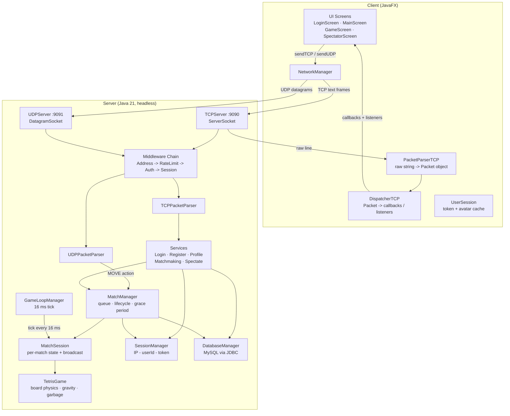

# Jetris

A real-time multiplayer online Tetris game built in Java. Two players compete in a best-of-5 format over a dual-protocol network layer (TCP + UDP), with live spectating, private rooms, in-match chat, user profiles, and paginated match history.

---

## Screenshots

> _Screenshots placeholder — add gameplay screenshots here._

---

## Features

- **1v1 real-time Tetris** — best-of-5 rounds (first to 3 wins), 5-second countdown between rounds
- **Dual-protocol networking** — TCP for authentication and control; UDP for real-time game input
- **Public matchmaking queue** — auto-pair with another online player instantly
- **Private rooms** — create a 6-character room code and share it with a friend
- **Live spectating** — watch any ongoing match in real time with full board view
- **In-match chat** — all participants (players and spectators) share a live chat channel
- **Garbage line system** — clearing lines sends garbage rows to the opponent (lines_cleared - 1)
- **DAS/ARR input** — client-side Delayed Auto Shift (150 ms) and Auto Repeat Rate (50 ms)
- **Disconnect grace period** — 30-second window before a disconnected player is forfeited
- **User profiles** — PNG avatar (up to 5 MB), win/loss record, paginated match history
- **Dark-mode JavaFX UI** — native Windows dark titlebar via JNA, animated screen transitions
- **Persistent auth tokens** — session token cached locally for seamless re-authentication
- **IP blacklist / rate limiting** — server middleware guards against flooding (TCP: 200 ms; UDP: 50 ms)

---

## Tech Stack

| Layer | Technology | Version |
|---|---|---|
| Language | Java | 21 |
| GUI | JavaFX | 21.0.4 |
| Build | Apache Maven | 3.8+ |
| Database | MySQL | 8.x |
| Password hashing | jBCrypt | 0.4 |
| Config | dotenv-java | 3.2.0 |
| Native windowing | JNA (Windows dark mode) | 5.14.0 |
| Transport (control) | TCP plain text persistent | — |
| Transport (gameplay) | UDP stateless datagrams | — |
| Concurrency | Java 21 virtual threads | — |

---

## Repository Structure

```
Jetris/
├── client/                         # JavaFX desktop client
│   ├── pom.xml
│   └── src/main/java/
│       ├── ClientMain.java         # JavaFX Application entry point
│       ├── Launcher.java           # Thin wrapper for jpackage
│       ├── config/
│       │   └── UserSession.java    # Local auth-token + avatar cache
│       ├── core/
│       │   └── ScreenManager.java  # Singleton screen switcher
│       ├── network/
│       │   ├── NetworkManager.java
│       │   ├── NetworkContext.java # Shared state + listener interfaces
│       │   ├── dispatcher/DispatcherTCP.java
│       │   ├── packets/            # loginPacket, matchPacket, chatPacket, ...
│       │   ├── parser/PacketParserTCP.java
│       │   ├── tcp/TCPClient.java
│       │   └── udp/UDPClient.java
│       └── ui/
│           ├── screens/            # LoginScreen, MainScreen, GameScreen, ...
│           └── service/            # MatchMakingService, MatchListService, ...
│
├── server/                         # Headless Java server
│   ├── pom.xml
│   └── src/main/java/
│       ├── ServerMain.java
│       ├── db/DatabaseManager.java
│       ├── matches/
│       │   ├── TetrisGame.java     # Board physics, gravity, garbage
│       │   ├── MatchSession.java   # Per-match state + broadcast
│       │   ├── MatchManager.java   # Queues, lifecycle, disconnect grace
│       │   ├── GameLoopManager.java# 16 ms tick scheduler
│       │   ├── SpectateManager.java
│       │   └── MatchState.java     # WAITING_FOR_PLAYERS, STARTING, IN_PROGRESS, FINISHED
│       ├── model/                  # User.java, Match.java
│       ├── network/
│       │   ├── NetworkManager.java
│       │   ├── SessionManager.java # IP <-> userId <-> token
│       │   ├── middleware/         # AddressMiddleware, RateLimitMiddleware, Auth, Session
│       │   ├── core/               # TCPServer, UDPServer
│       │   ├── connection/         # TCPConnectionManager, UDPConnectionManager
│       │   └── parser/             # TCPPacketParser, UDPPacketParser
│       └── service/
│           ├── auth/               # LoginService, RegisterService, LogoutService, DeleteService
│           ├── matchmaking/        # MatchmakingService, SpectateService
│           └── ProfileService.java
│
└── docs/
    ├── PROTOCOL.md                 # Full network protocol reference
    └── HTTP_PROTOCOL.md            # Custom TCP text protocol design doc
```

---

## Quick Start

### Prerequisites

- Java 21+
- Maven 3.8+
- MySQL 8.x

### 1. Database Setup

```sql
CREATE DATABASE jetris;
USE jetris;

CREATE TABLE users (
    id            INT AUTO_INCREMENT PRIMARY KEY,
    username      VARCHAR(25) NOT NULL UNIQUE,
    password      VARCHAR(255) NOT NULL,
    pfp           LONGBLOB,
    matches_won   INT DEFAULT 0,
    matches_lost  INT DEFAULT 0
);

CREATE TABLE match_history (
    id               INT AUTO_INCREMENT PRIMARY KEY,
    user1_id         INT NOT NULL,
    user2_id         INT NOT NULL,
    duration_seconds INT DEFAULT 0,
    score_user1      INT DEFAULT 0,
    score_user2      INT DEFAULT 0,
    winner_id        INT NOT NULL,
    match_date       TIMESTAMP DEFAULT CURRENT_TIMESTAMP,
    FOREIGN KEY (user1_id) REFERENCES users(id) ON DELETE CASCADE,
    FOREIGN KEY (user2_id) REFERENCES users(id) ON DELETE CASCADE
);
```

### 2. Configure and Run the Server

Create `server/src/main/resources/config/.env`:

```env
DB_HOST=jdbc:mysql://localhost:3306/jetris
DB_USER=root
DB_PASSWORD=secret
TCP_PORT=9090
UDP_PORT=9091
```

```bash
cd server
mvn exec:java
```

### 3. Configure and Run the Client

Create `client/src/main/resources/config/.env` (place under `/config` directory relative to the working directory at runtime):

```env
SERVER_HOST=127.0.0.1
SERVER_PORT_TCP=9090
SERVER_PORT_UDP=9091
```

```bash
cd client
mvn exec:java
```

---

## High-Level Architecture


```mermaid
graph TD
    subgraph Client["Client (JavaFX)"]
        UI["UI Screens\nLoginScreen · MainScreen\nGameScreen · SpectatorScreen"]
        NM_C["NetworkManager"]
        PP["PacketParserTCP\nraw string -> Packet object"]
        DT["DispatcherTCP\nPacket -> callbacks / listeners"]
        US["UserSession\ntoken + avatar cache"]
    end

    subgraph Server["Server (Java 21, headless)"]
        TCP_S["TCPServer :9090\nServerSocket"]
        UDP_S["UDPServer :9091\nDatagramSocket"]
        MW["Middleware Chain\nAddress -> RateLimit -> Auth -> Session"]
        PARSER_T["TCPPacketParser"]
        PARSER_U["UDPPacketParser"]
        SVC["Services\nLogin · Register · Profile\nMatchmaking · Spectate"]
        MM["MatchManager\nqueue · lifecycle · grace period"]
        MS["MatchSession\nper-match state + broadcast"]
        TG["TetrisGame\nboard physics · gravity · garbage"]
        GL["GameLoopManager\n16 ms tick"]
        SM["SessionManager\nIP - userId - token"]
        DB["DatabaseManager\nMySQL via JDBC"]
    end

    UI -->|"sendTCP / sendUDP"| NM_C
    NM_C -->|"TCP text frames"| TCP_S
    NM_C -->|"UDP datagrams"| UDP_S
    TCP_S --> MW
    UDP_S --> MW
    MW --> PARSER_T
    MW --> PARSER_U
    PARSER_T --> SVC
    PARSER_U -->|"MOVE action"| MM
    SVC --> MM
    SVC --> SM
    SVC --> DB
    MM --> MS
    MS --> TG
    GL -->|"tick every 16 ms"| MS
    MM --> DB
    MM --> SM
    TCP_S -->|"raw line"| PP
    PP --> DT
    DT -->|"callbacks + listeners"| UI
```

---

## Documentation

| Document | Description |
|---|---|
| [server/README.md](server/README.md) | Server architecture, middleware, match lifecycle, class diagram, DB schema |
| [client/README.md](client/README.md) | Client architecture, screen flow, DAS/ARR, network layer |
| [docs/PROTOCOL.md](docs/PROTOCOL.md) | Full network protocol reference with packet flow examples |
| [docs/HTTP_PROTOCOL.md](docs/HTTP_PROTOCOL.md) | Custom TCP text protocol design, grammar, and HTTP comparison |

---

## License

_License placeholder — add your license here._
