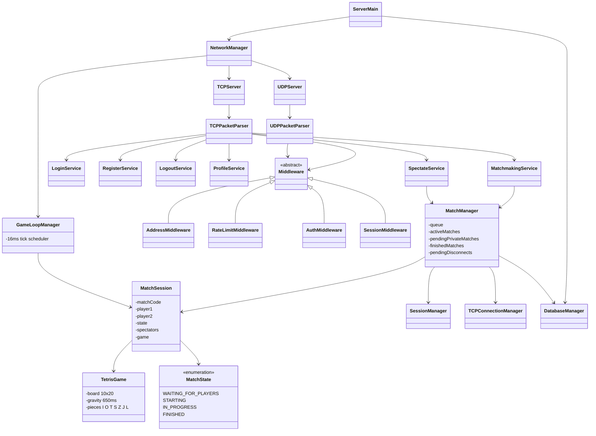

# Jetris — Server

Headless Java 21 server. Runs a TCP listener for control messages and a UDP listener for game inputs. All match logic executes server-side; the server broadcasts board state to players and spectators every time it changes.

Every incoming TCP connection and every UDP datagram gets its own Java 21 virtual thread. Packets pass through a four-step middleware chain (address block → rate limit → auth → session) before reaching the service layer.

---

## How to Run

Create `src/main/resources/config/.env`:

```env
DB_HOST=jdbc:mysql://localhost:3306/jetris
DB_USER=root
DB_PASSWORD=secret
TCP_PORT=9090
UDP_PORT=9091
```

```bash
mvn exec:java
# or build a fat JAR:
mvn package && java -jar target/libs/JetrisServer.jar
```

---

## Class Diagram


