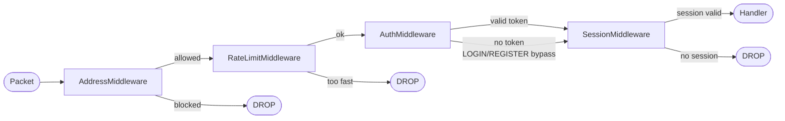
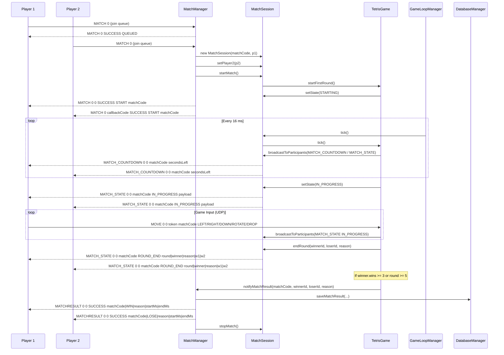
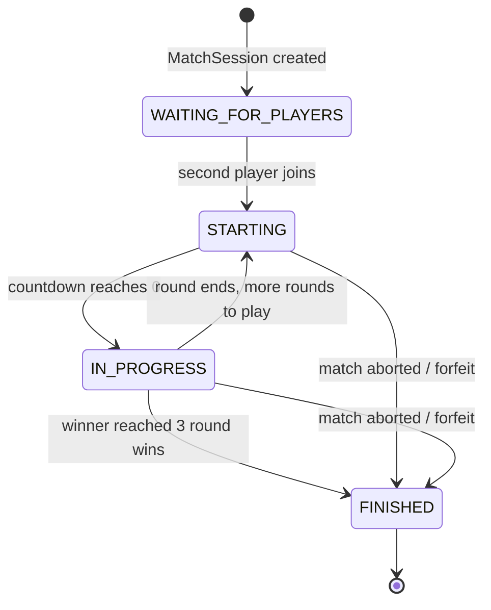
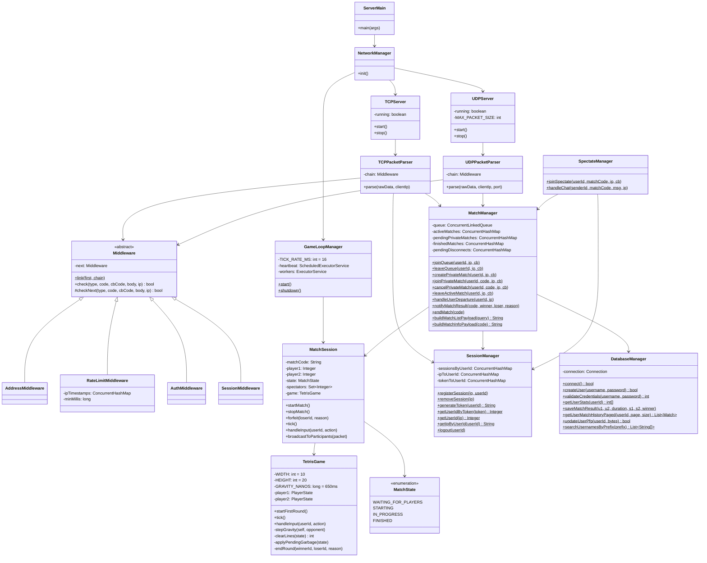

# Jetris — Server

The Jetris server is a headless Java 21 application that manages authentication, matchmaking, real-time Tetris game logic, spectating, and user profiles. It runs two network listeners in parallel: a persistent TCP server for control messages and a stateless UDP server for high-frequency game input.

---

## How to Run

### Prerequisites

- Java 21+
- Maven 3.8+
- MySQL 8.x

### Configuration

Create `src/main/resources/config/.env`:

```env
DB_HOST=jdbc:mysql://localhost:3306/jetris
DB_USER=root
DB_PASSWORD=secret
TCP_PORT=9090
UDP_PORT=9091
```

### Run

```bash
mvn exec:java
```

### Build Fat JAR

```bash
mvn package
java -jar target/libs/JetrisServer.jar
```

---

## Architecture Overview

```
ServerMain
  ├── DatabaseManager.connect()     — fail-fast: exits if DB unreachable
  └── NetworkManager.init()
        ├── TCPServer (virtual thread)
        ├── UDPServer (virtual thread)
        └── GameLoopManager.start()   — 16 ms scheduled heartbeat
```

Every incoming TCP connection gets its own Java 21 virtual thread (`TCPClientHandler`). Every UDP datagram also gets its own virtual thread (`UDPClientHandler`). Virtual threads are extremely cheap so the server can handle many concurrent connections with no thread-pool bottleneck.

---

## Middleware Chain

Both the TCP and UDP parsers run every packet through an identical chain-of-responsibility before it reaches business logic.

```
Incoming packet
      |
      v
AddressMiddleware        — reject blacklisted IPs
      |
      v
RateLimitMiddleware      — reject if < minInterval since last packet
      |  (TCP: 200 ms,  UDP: 50 ms)
      v
AuthMiddleware           — reject if token not in SessionManager
      |  (LOGIN and REGISTER bypass this step)
      v
SessionMiddleware        — reject if no active IP session
      |  (LOGIN, REGISTER, PING bypass)
      v
Packet Parser / Handler
```



The chain is implemented as an abstract `Middleware` class with a linked-list of `next` nodes. Each node calls `checkNext(...)` to continue, or returns `false` to abort.

---

## Services Layer

| Service | Responsibilities |
|---|---|
| `LoginService` | Validates credentials with BCrypt, generates UUID token, registers session, sends avatar |
| `RegisterService` | Validates input format, checks uniqueness, BCrypt-hashes password, inserts user |
| `LogoutService` | Removes session, triggers immediate forfeit if in match |
| `DeleteService` | Deletes user row, cascades to match history |
| `ProfileService` | Username search (prefix), paginated profile + match history, avatar upload (PNG, max 5 MB) |
| `MatchmakingService` | Routes MATCH 0-8 codes to `MatchManager` |
| `SpectateService` | Routes SPECTATE codes to `SpectateManager` |

---

## Match Lifecycle



### Match States



---

## Game Loop

`GameLoopManager` runs a single `ScheduledExecutorService` heartbeat at 16 ms intervals (approximately 62 ticks per second). For up to 10 concurrent matches, all sessions are ticked inline on the heartbeat thread. For more than 10 matches, ticks are parallelized across a fixed thread pool sized to the number of CPU cores.

Inside each `TetrisGame.tick()`:

- **STARTING state** — broadcasts `MATCH_COUNTDOWN` every tick until the 5-second countdown expires, then transitions to `IN_PROGRESS`.
- **IN_PROGRESS state** — applies gravity every 650 ms (GRAVITY_NANOS). On each gravity step: attempts to move the piece down; if it cannot move, locks the piece, clears full lines, sends garbage to the opponent, and spawns the next piece. If spawning fails, the player tops out and the round ends.

---

## TetrisGame Engine

| Constant | Value |
|---|---|
| Board width | 10 columns |
| Board height | 20 rows |
| Gravity interval | 650 ms |
| Round countdown | 5 seconds |
| Pieces | I, O, T, S, Z, J, L (indices 0-6) |
| Garbage formula | `max(0, linesCleared - 1)` rows sent to opponent |

Rotation uses a simple wall-kick with offsets `[0, -1, 1, -2, 2]`. The board is encoded as a flat 200-character string (`'.' = empty`, `'1'-'7' = piece type`, `'8' = garbage`) for efficient transmission.

---

## Disconnect Grace Period

When a TCP connection drops, `SessionManager.removeSession()` calls `MatchManager.handleUserDeparture()`, which schedules a 30-second forfeit timer via a `ScheduledExecutorService`. If the player reconnects within 30 seconds and re-authenticates, `handleUserReconnected()` cancels the timer. If the timer fires and the player is still offline, the opponent wins by `Player_timeout`.

---

## Main Class Diagram



---

## Database Schema

### `users`

| Column | Type | Notes |
|---|---|---|
| `id` | INT PK AUTO_INCREMENT | |
| `username` | VARCHAR(25) UNIQUE | 5-25 chars, alphanumeric + underscore |
| `password` | VARCHAR(255) | BCrypt hash |
| `pfp` | LONGBLOB | PNG bytes, max 5 MB |
| `matches_won` | INT DEFAULT 0 | Incremented atomically on match result |
| `matches_lost` | INT DEFAULT 0 | Incremented atomically on match result |

### `match_history`

| Column | Type | Notes |
|---|---|---|
| `id` | INT PK AUTO_INCREMENT | |
| `user1_id` | INT FK → users.id | CASCADE DELETE |
| `user2_id` | INT FK → users.id | CASCADE DELETE |
| `duration_seconds` | INT | Wall-clock duration |
| `score_user1` | INT | Reserved (currently 0) |
| `score_user2` | INT | Reserved (currently 0) |
| `winner_id` | INT | References users.id |
| `match_date` | TIMESTAMP DEFAULT NOW() | |

Match results are written inside a transaction that also increments `matches_won` for the winner and `matches_lost` for the loser atomically.

---

## Environment Variables

| Variable | Example | Description |
|---|---|---|
| `DB_HOST` | `jdbc:mysql://localhost:3306/jetris` | Full JDBC URL |
| `DB_USER` | `root` | MySQL user |
| `DB_PASSWORD` | `secret` | MySQL password |
| `TCP_PORT` | `9090` | TCP listen port |
| `UDP_PORT` | `9091` | UDP listen port |
